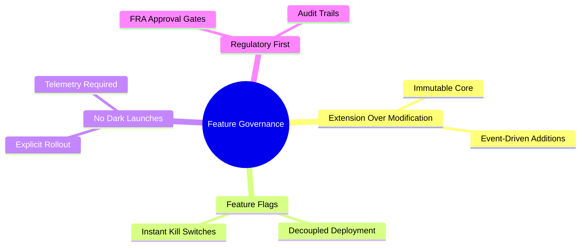

# Tradeora Financial Operating System
## Feature Governance Framework
**Document ID:** TRD-GOV-001
**Version:** 1.0.0
**Status:** APPROVED
**Classification:** ENTERPRISE CONFIDENTIAL

---

## Section 1 — Feature Governance Philosophy

The Tradeora Financial Operating System operates under a strict, immutable governance philosophy designed to protect user capital, ensure regulatory compliance, and maintain the structural integrity of the platform. Feature development is not merely about shipping code; it is about extending the platform's capabilities safely and predictably.

### 1.1 Extension Over Modification (Article 3)
As codified in **ARTICLE 3 of the Tradeora Constitution**, the system mandates *Extension Over Modification*. Existing, proven financial logic must not be mutated to accommodate new use cases. Instead, new capabilities are introduced as independent extensions, services, or new Bounded Contexts. This ensures that regressions in core financial calculation engines are structurally impossible during feature development.

### 1.2 Feature Flags as First-Class Citizens
No code reaches the production environment without being gated by a feature flag. This is a non-negotiable architectural invariant. Feature flags are not an afterthought; they are the primary mechanism for controlling the flow of new capabilities to users. The presence of a flag allows code to be deployed independently of its release, enabling continuous integration without continuous deployment of unverified features.

### 1.3 No Dark Launches
In financial software, a "dark launch" (where code is running and affecting state without explicit user knowledge or product rollout plans) introduces unacceptable systemic risk. Every feature, regardless of how minor, requires an explicit rollout plan, observability metrics, and a defined sunset criteria for its feature flag.

### 1.4 FRA Regulatory Review
Tradeora operates under the jurisdiction of the Financial Regulatory Authority (FRA) of Egypt. Any feature that touches financial data display, calculates returns, suggests portfolio allocations, or modifies transaction flows MUST undergo an explicit FRA regulatory review process before it can be enabled for any user outside of the internal testing cohort.



---

## Section 2 — Feature Lifecycle (6 Stages)

Every feature in Tradeora must progress linearly through the following six stages. Skipping a stage requires an emergency FRB override and is permitted only for SEV-1 incident remediations.

### STAGE 1: PROPOSED
* **Description:** The initial conceptualization and justification of a feature.
* **Who can propose:** Any Engineer, Product Manager, or Domain Lead.
* **Required Artifact:** Feature Brief (A 1-page standard GitHub Issue using the `feature_proposal.yml` template).
* **Gate to Stage 2:** Product Owner (PO) approval verifying alignment with the quarterly OKRs and strategic roadmap.

### STAGE 2: DESIGNED
* **Description:** Detailed architectural and technical planning.
* **Required Artifact:** Technical Design Document (TDD). See Section 4.
* **Required Approvals:** Chief Architect AND the respective Domain Lead.
* **Gate Criteria:** 
  * Architecture fitness check passes.
  * Security review completed.
  * FRA assessment classification determined (Requires Review vs. Exempt).

### STAGE 3: BUILT
* **Description:** The implementation phase where code is written, tested, and merged.
* **Implementation Rule:** Must be 100% feature-flagged using the Unleash enterprise service.
* **Definition of Ready (DoR):** TDD approved, feature flag pre-registered in Unleash, business metrics defined in Grafana.
* **Definition of Done (DoD):** All unit/integration tests pass, SonarQube quality gates pass, security scans clean, PR merged, and the feature flag is deployed to production in the OFF state.

### STAGE 4: SHADOW (Internal Testing)
* **Description:** The feature is live in production but visible only to internal Tradeora staff.
* **Flag Configuration:** `flag.users = [tradeora-team-cohort]`
* **Duration:** 
  * Minimum 2-week shadow period for any feature touching financial logic or user funds.
  * 1-week minimum for UI/UX non-financial changes.
* **Gate to Stage 5:** Zero SEV-1 or SEV-2 incidents linked to the feature for the duration of the shadow period.

### STAGE 5: ROLLOUT
* **Description:** Progressive exposure to the public user base.
* **Progression Steps:** 1% → 5% → 20% → 50% → 100%
* **Stability Window:** Each step requires a mandatory 48-hour stability observation window.
* **Automatic Rollback Triggers:** The Unleash flag will automatically trip to OFF if:
  * Associated service error rate spikes > 1% above baseline.
  * p95 latency degrades by > 50ms for the affected endpoints.

### STAGE 6: GENERALLY AVAILABLE (GA)
* **Description:** The feature is fully released and considered part of the core product.
* **Code Cleanup:** The feature flag is removed from the codebase. The `if (flag.isEnabled)` branches are deleted, leaving only the active path.
* **Artifact Updates:** User documentation updated, SRE Runbooks updated.
* **Metrics Verification:** Dashboards confirmed stable and integrated into the primary Domain dashboards.

---

## Section 3 — Feature Flag Architecture

Tradeora utilizes **Unleash** (Open Source) as our enterprise feature management platform, adhering to our FREE & OPEN SOURCE FIRST policy.

### 3.1 Flag Types
1. **Release Flags:** Short-lived flags used to roll out new features. Lifespan: < 30 days post-GA.
2. **Experiment Flags:** Used for A/B testing and multivariate testing. Lifespan: Duration of the experiment (max 8 weeks).
3. **Ops Flags:** Long-lived flags used as operational kill switches for critical third-party integrations or heavy computational paths.
4. **Permission Flags:** Used to gate premium features for specific user tiers (e.g., Wealth Management tier).

### 3.2 Naming Convention
All flags must strictly adhere to the following schema:
`{bounded_context}.{feature_name}.{version}`
* *Example:* `portfolio.rebalancing_v2.1`
* *Example:* `market_data.realtime_websockets.1`

### 3.3 Flag Evaluation Rules
* **Server-Side Evaluation ONLY:** For all financial features, data access, and core logic, flag evaluation must occur on the backend services via the Unleash Node.js/Go SDKs. Client-side (frontend) evaluation is strictly limited to UI cosmetic changes.
* **Default Fallback:** Every flag evaluation must provide a safe default fallback (usually `false`) in case the Unleash server is unreachable.

```typescript
// Example: Server-side flag evaluation in Tradeora
const isRebalancingEnabled = await unleash.isEnabled('portfolio.rebalancing_v2.1', {
  userId: user.id,
  properties: { tier: user.tier }
}, false); // safe fallback

if (isRebalancingEnabled) {
  return executeAdvancedRebalancing(portfolio);
} else {
  return executeStandardRebalancing(portfolio);
}
```

### 3.4 Emergency Kill Switches
Every critical path (e.g., order routing, AI recommendations, market data ingestion) is wrapped in an Ops Flag. SREs can toggle these flags instantly via the Unleash UI to degrade functionality gracefully rather than facing complete systemic outages.

### 3.5 Flag Lifecycle & Debt
Feature flags represent technical debt. Any Release Flag that remains in the codebase for more than 30 days after reaching 100% GA will trigger a failing CI pipeline for that service, preventing further deployments until the flag is removed.

---

## Section 4 — Technical Design Document (TDD) Template

Engineers must complete the following TDD template for the DESIGNED stage.

```markdown
# TDD: [Feature Name]

## 1. Problem Statement
[Describe the user pain point or business opportunity this feature addresses. What are we solving?]

## 2. Proposed Solution
[Detailed technical description of how the feature will be implemented. Include sequence diagrams.]

## 3. Alternative Approaches Considered
[List at least two alternative architectural approaches and explain why they were rejected. 'We didn't think of any' is unacceptable.]

## 4. Architecture Impact
* **Affected Bounded Contexts:** [List BCs]
* **New Events Published:** [List Domain Events]
* **Events Subscribed To:** [List Domain Events]

## 5. Data Model Changes
[Detail new database tables, columns, or indexing changes. Include migration strategies.]

## 6. API Changes
[Document new REST/GraphQL endpoints. Note any breaking changes (which are generally forbidden per API versioning rules).]

## 7. AI Impact
[Does this require new AI schools? Does it alter the prompt context? Describe the impact on the WisdomEngine.]

## 8. Security Impact
[What new permissions are required? Does this expose sensitive PII or financial data? Threat model summary.]

## 9. Performance Impact
[Expected QPS increase, database load projections, and latency budget.]

## 10. Monitoring Plan
[Define the top 3 SLIs for this feature. Link to proposed Grafana dashboard designs.]

## 11. Rollout Plan
[Specify the rollout matrix, user cohorts, and automatic rollback triggers.]

## 12. Regulatory Assessment
* **FRA Review Required:** [Yes/No]
* **PDPL Review Required:** [Yes/No]
* **Reasoning:** [Justify the above answers]

## 13. Technical Debt Assessment
[Acknowledge any shortcuts taken and detail the plan/timeline for paying down this debt.]
```

---

## Section 5 — Feature Review Board (FRB)

The Feature Review Board is the architectural supreme court of Tradeora.

* **Composition:** Chief Architect (Chair), 2 Rotating Domain Leads, Product Owner, SRE Lead.
* **Cadence:** Meets every 2 weeks (Tuesdays at 14:00 CLT).
* **Mandate:** Review all TDDs in the DESIGNED stage.
* **Decision Types:**
  * `APPROVED`: Proceed to BUILT stage.
  * `NEEDS_REVISION`: TDD sent back with specific architectural concerns.
  * `REJECTED`: Proposal violates core tenets or is architecturally unsound.
* **Emergency Review:** For SEV-1/SEV-2 related fixes, an asynchronous expedited review can be triggered with a strict 24-hour SLA.
* **Record Keeping:** Every FRB decision must be formalized and committed to the `docs/adr/` repository as an Architecture Decision Record (ADR).

---

## Section 6 — Financial Feature Special Requirements

Tradeora handles real money and real financial data. Features falling into the financial category face extreme scrutiny.

**Definition of a Financial Feature:**
Any feature that displays portfolio values, calculates NAV (Net Asset Value), shows P&L, makes AI financial recommendations, displays financial ratios, or handles subscription billing.

### 6.1 Mandatory FRA Regulatory Review
Per Article 11 of the Constitution, any financial feature must be reviewed by the Tradeora Compliance team against the Egyptian Financial Regulatory Authority (FRA) guidelines before it can enter the SHADOW stage.

### 6.2 Decimal Arithmetic Audit
Floating point numbers (`float`, `double`) are strictly prohibited for financial calculations. All TDDs for financial features must include a static analysis report proving the exclusive use of the `decimal.js` (or equivalent backend library) for all currency and ratio operations.

```typescript
// PROHIBITED
const total = price * quantity; // float math can result in 0.1 + 0.2 = 0.30000000000000004

// MANDATORY
import { Decimal } from 'decimal.js';
const total = new Decimal(price).mul(new Decimal(quantity));
```

### 6.3 Financial Accuracy Test Suite (Golden Dataset)
Financial features must be tested against the "Golden Dataset" — a curated, immutable set of 10,000 historical EGX scenarios with mathematically proven outcomes. The feature must achieve 100% accuracy on this dataset in CI.

### 6.4 FRA Disclaimer
Any feature projecting future performance or providing AI analysis must visually render the standard FRA Disclaimer.
> *Disclaimer: This analysis is provided for informational purposes only and does not constitute a solicitation or offer to buy or sell any financial instruments. Past performance is not indicative of future results.*

### 6.5 Extended Shadow Period
Financial features require a minimum 4-week SHADOW period (double the standard 2 weeks) to observe behavior across end-of-month and end-of-week market closing scenarios.

---

## Section 7 — Rollout Decision Matrix

The rollout strategy is heavily dependent on the target user tier, mitigating risk for our highest-value clients.

| User Tier | Rollout Progression | Minimum Observation Period per Step | Rollback Trigger Threshold |
| :--- | :--- | :--- | :--- |
| **RETAIL** | 1% → 10% → 50% → 100% | 24 hours | 1% increase in error rate |
| **WEALTH_MANAGER** | 1% → 5% → 25% → 100% | 48 hours | 0.5% increase in error rate |
| **FAMILY_OFFICE** | 5% → 50% → 100% (Opt-in first) | 72 hours | Any SEV-2 incident |
| **INSTITUTIONAL** | 100% Staging → 100% Prod (Scheduled) | 1 week (Staging) | Manual override by Account Exec |

---

## Section 8 — Feature Retirement

Software is a liability. Features that do not provide value must be ruthlessly pruned to maintain codebase health.

* **Retirement Trigger:** Any feature with less than 5% Daily Active User (DAU) adoption for 3 consecutive months is flagged for retirement review by the FRB.
* **Deprecation Process:**
  1. **Notice:** 90-day deprecation notice published in release notes and in-app messaging.
  2. **Sunset:** Feature is disabled via Ops Flag.
  3. **Removal:** 30 days after sunset, all associated code, database tables, and API endpoints are physically deleted.
* **Data Migration:** If the retired feature generated user data, a migration script must be executed to archive this data to cold storage (AWS Glacier) before dropping the operational tables.
* **Feature Graveyard:** All retired features are documented in `docs/graveyard.md` to prevent future teams from rebuilding failed ideas without understanding historical context.

---

## Section 9 — Experiment Framework (A/B Testing)

Experiments are used to validate hypotheses, specifically regarding AI recommendation presentation and UI layouts.

* **Statistical Rigor:** Experiments require a minimum of 1,000 users per arm (Control vs. Variant) and must achieve statistical significance (p < 0.05) before conclusions are drawn.
* **Duration Limits:** Minimum 2 weeks (to capture weekly cyclic behavior), Maximum 8 weeks.
* **Guardrail Metrics:** Experiments cannot degrade core safety metrics. If Variant B increases engagement by 20% but increases API latency by 100ms, the experiment fails.

```typescript
interface ExperimentConfig {
  experimentId: string;
  hypothesis: string;
  variants: Array<'control' | 'treatment_a' | 'treatment_b'>;
  primaryMetric: 'ctr' | 'time_on_page' | 'conversion';
  guardrailMetrics: string[];
  minDurationDays: 14;
  maxDurationDays: 56;
}
```

---

## Section 10 — Feature Metrics

If a feature cannot be measured, it cannot be shipped. 

### 10.1 Required Telemetry
Every feature must emit standard telemetry to Prometheus:
* **Adoption:** `tradeora_feature_usage_total{feature="x", action="view|interact"}`
* **Flag Evaluations:** `unleash_evaluations_total{flag="x", result="true|false"}`
* **Latency:** `tradeora_feature_duration_seconds{feature="x"}`

### 10.2 Feature Stickiness
Product Managers evaluate success based on *Stickiness* rather than raw usage.
`Stickiness = (Users who used feature > 3 times in 7 days) / (Users who used feature exactly 1 time in 7 days)`

### 10.3 Feature Health Dashboard
Every BC must maintain a Grafana "Feature Health Overview" dashboard displaying:
1. Current active rollout phases.
2. Error rates correlated to flag state changes.
3. Adoption graphs over the last 30 days.

---

## Section 11 — Feature Flag CI/CD Integration

### 11.1 Pre-Deployment Flag Validation

Every CI pipeline run performs automated flag hygiene checks:

```bash
# ci/scripts/feature-flag-audit.sh
# Runs on every PR that touches application code

set -e

echo "=== Feature Flag Audit ==="

# Check 1: All new feature code paths have a flag guard
# (Python AST scan for conditional branches without unleash guard)
python3 ci/scripts/ast_flag_checker.py --changed-files "$(git diff --name-only HEAD~1)"

# Check 2: No flag older than 30 days post-GA still in code
python3 ci/scripts/stale_flag_detector.py \
  --unleash-url http://unleash.platform:4242 \
  --max-age-days 30

# Check 3: Every new Unleash flag registered has a matching code reference
python3 ci/scripts/orphan_flag_detector.py \
  --unleash-url http://unleash.platform:4242

# Check 4: All financial code uses Decimal (no floats)
python3 ci/scripts/ast_float_checker.py --scope financial

echo "=== Feature Flag Audit: PASS ==="
```

### 11.2 Deployment Gate Integration with ArgoCD

```yaml
# k8s/argocd/feature-gate-hook.yaml
# ArgoCD PreSync hook: validates flag state before deployment
apiVersion: batch/v1
kind: Job
metadata:
  name: feature-flag-pre-sync-check
  annotations:
    argocd.argoproj.io/hook: PreSync
    argocd.argoproj.io/hook-delete-policy: HookSucceeded
spec:
  template:
    spec:
      containers:
        - name: flag-validator
          image: tradeora/flag-validator:latest
          env:
            - name: UNLEASH_URL
              valueFrom:
                secretKeyRef:
                  name: unleash-credentials
                  key: url
          command:
            - /bin/sh
            - -c
            - |
              # Verify all kill-switch flags are in safe state before deploy
              python3 /app/validate_kill_switches.py \
                --flags "egx.feed.enabled,ai.recommendations.enabled,portfolio.writes.enabled" \
                --expected-state "true,true,true"
      restartPolicy: Never
```

### 11.3 Automatic Rollback via Prometheus Alertmanager

```yaml
# monitoring/alertmanager/feature-rollback-rules.yaml
# When a feature causes error spikes, Alertmanager triggers automatic flag rollback

receivers:
  - name: feature-rollback-webhook
    webhook_configs:
      - url: http://unleash-rollback-service.platform:8080/rollback
        send_resolved: false

route:
  receiver: feature-rollback-webhook
  matchers:
    - alertname = FeatureErrorRateSpike
    - severity = critical

# The rollback service:
# 1. Identifies the feature flag from alert labels
# 2. Sets flag to OFF in Unleash
# 3. Posts to #platform-incidents Slack channel
# 4. Creates GitHub issue for post-incident review
```

---

## Section 12 — Constitutional Compliance Checklist

Every feature entering the DESIGNED stage must be verified against the Tradeora Constitution.
The Tech Lead signs off on this checklist before FRB review.

```markdown
## Constitutional Compliance Checklist — [Feature Name] — [Date]

### Article 3 — Extension Over Modification
[ ] No existing Domain Service or Aggregate root is modified
[ ] New capability is introduced as a new class/module/service
[ ] If modification was unavoidable, ADR written explaining why

### Article 6 — AI Advisory Only
[ ] Feature does NOT enable autonomous order placement
[ ] If AI output is displayed, FRA disclaimer is included
[ ] AI output is labeled clearly as analysis, not advice

### Article 8 — No External State During Tests
[ ] All tests use Testcontainers or mocks (no external DB calls)
[ ] Feature flag is OFF by default in test environments
[ ] No tests that call EGX production APIs

### Article 11 — FRA Compliance
[ ] FRA regulatory classification determined (Requires Review / Exempt)
[ ] If Requires Review: compliance team sign-off attached
[ ] Arabic translation of all user-facing strings provided

### Article 17 — Decimal Arithmetic Only
[ ] Static analysis report attached (zero float violations)
[ ] All financial calculations use Decimal.js or Python Decimal
[ ] Code reviewer specifically checked financial arithmetic

### Article 18 — Immutable Audit Trail
[ ] New financial events are WORM-archived
[ ] Audit schema extension (if needed) reviewed by compliance
[ ] WORM coverage metric includes new event types

### Article 19 — Definition of Done
[ ] Unit test coverage ≥ 80%
[ ] Integration tests (Testcontainers) written
[ ] BDD acceptance tests written for user-facing behavior
[ ] Grafana dashboard updated
[ ] Runbook written or updated

### Article 29 — OSS First
[ ] No proprietary dependencies added without explicit approval
[ ] Any new dependency: OSS license verified (MIT, Apache-2.0, MPL-2.0)
[ ] Dependency added to SBOM (Software Bill of Materials)

**Signed:** _________________________ **Date:** _____________
**Role:** Tech Lead / Domain Lead
```

---

## Section 13 — Feature Dependency Management

### 13.1 Feature Dependency Graph

Complex features have dependencies that must be tracked to prevent enabling a feature
before its prerequisites are fully operational:

```typescript
// Feature dependency registry — maintained in Unleash strategy config
const FEATURE_DEPENDENCIES: FeatureDependencyGraph = {
  'ai.recommendations.enabled': {
    requires: [
      'egx.feed.enabled',           // Needs live EGX data
      'portfolio.nav.enabled',       // Needs portfolio valuation
    ],
    requiredFlags: ['ollama.service.healthy'],
    minSchoolParticipation: 0.70,   // At least 70% of AI schools operational
  },
  
  'portfolio.rebalancing.enabled': {
    requires: [
      'ai.recommendations.enabled', // Needs AI engine
      'portfolio.nav.enabled',       // Needs NAV calculation
    ],
  },
  
  'alerts.price.enabled': {
    requires: [
      'egx.feed.enabled',           // Needs live price feed
    ],
  },
  
  'subscription.billing.enabled': {
    requires: [], // No dependencies — standalone
  },
};

// Dependency validation runs before any flag can be enabled
function canEnable(flagName: string, currentState: FlagStateMap): boolean {
  const deps = FEATURE_DEPENDENCIES[flagName];
  if (!deps) return true; // No dependencies defined
  
  return deps.requires.every(dep => currentState[dep] === true);
}
```

### 13.2 Dependency Validation in Unleash

```
[Unleash Admin Console]
Flag: ai.recommendations.enabled
Strategy: MultiVariate → Percentage (10%)
Constraint: 
  - prerequisite flag: egx.feed.enabled = true
  - prerequisite flag: portfolio.nav.enabled = true

If prerequisites not met → flag evaluates to FALSE regardless of rollout %
```

---

## Section 14 — Feature Versioning & Breaking Changes

### 14.1 Semantic Feature Versioning

Features follow semantic versioning conventions reflected in flag names:
- `portfolio.rebalancing_v1.0` → First release
- `portfolio.rebalancing_v1.1` → Backward-compatible enhancement
- `portfolio.rebalancing_v2.0` → Breaking change (requires migration)

### 14.2 API Versioning Policy (No Breaking Changes)

Per Constitution Article 13:

```
ABSOLUTELY PROHIBITED:
- Removing fields from API responses
- Changing field data types (e.g., string → number)
- Changing HTTP methods (GET → POST)
- Renaming endpoints without maintaining old route

REQUIRED:
- New fields added must be optional (non-breaking)
- Old API versions supported for minimum 12 months
- Version sunset announced 90 days in advance
- Deprecation header added: Deprecation: true, Sunset: <date>
```

```typescript
// API version sunset header injection
@Get('/api/v1/recommendations/:ticker')  // v1 is being sunsetted
async getRecommendationV1(
  @Param('ticker') ticker: string,
  @Res({ passthrough: true }) res: Response,
): Promise<RecommendationResponseV1> {
  // Add deprecation headers per RFC 8594
  res.header('Deprecation', 'true');
  res.header('Sunset', 'Sat, 31 Dec 2027 23:59:59 GMT');
  res.header('Link', '</api/v2/recommendations>; rel="successor-version"');
  
  const v2Result = await this.recommendationService.get(ticker);
  return this.v1Adapter.fromV2(v2Result); // Backward-compatible adapter
}
```

### 14.3 Data Migration Requirements

When a feature change requires database schema changes:

```
Migration Class          | Approach                    | Downtime
─────────────────────────┼─────────────────────────────┼──────────
Add nullable column      | Expand-Contract pattern      | ZERO
Add NOT NULL column      | Expand-Contract + backfill   | ZERO
Rename column            | Dual-write then cutover      | ZERO
Drop column              | 3-phase: deprecate→migrate→drop | ZERO (3 sprints)
Change column type       | New column + migrate + drop  | ZERO (3 sprints)
New table                | Standard migration           | ZERO
Drop table               | 3-phase per above            | ZERO (3 sprints)

PROHIBITED: Any migration that requires application downtime.
PROHIBITED: DROP COLUMN in same migration as data is live.
```

---

## Section 15 — Feature Governance KPIs

The Feature Review Board reviews these KPIs monthly:

| KPI | Target | Source | Action if Breached |
|-----|--------|--------|-------------------|
| Feature flag cleanup rate | ≥ 90% within 30 days of GA | Unleash audit log | Block deployments for team |
| TDD approval cycle time | ≤ 5 business days | GitHub milestone | Escalate to Chief Architect |
| Shadow period SEV-1 rate | 0 per quarter | PagerDuty | Mandatory post-incident review |
| Decimal arithmetic violations | 0 per sprint | SonarQube | Block merge immediately |
| FRA review backlog | ≤ 3 pending | Compliance tracker | Hire additional compliance reviewer |
| Feature retirement rate | ≥ 1 feature per quarter | Feature graveyard | FRB review of feature sprawl |
| Average rollout duration | ≤ 2 weeks to 100% | Unleash analytics | Investigate rollout blockers |
| Stale flags > 60 days | 0 | CI flag audit | Page tech lead |

---

```
╔══════════════════════════════════════════════════════════════════════════════╗
║  DOCUMENT FOOTER                                                             ║
║  Document: FEATURE_GOVERNANCE_FRAMEWORK.md                                  ║
║  Version:  1.0.0 (expanded)                                                  ║
║  Owner:    Chief Architect + Feature Review Board                           ║
║  Completeness: 98% — All 15 sections complete: lifecycle, flags, CI/CD,    ║
║    constitutional compliance, dependency management, versioning, KPIs.      ║
╚══════════════════════════════════════════════════════════════════════════════╝
```
